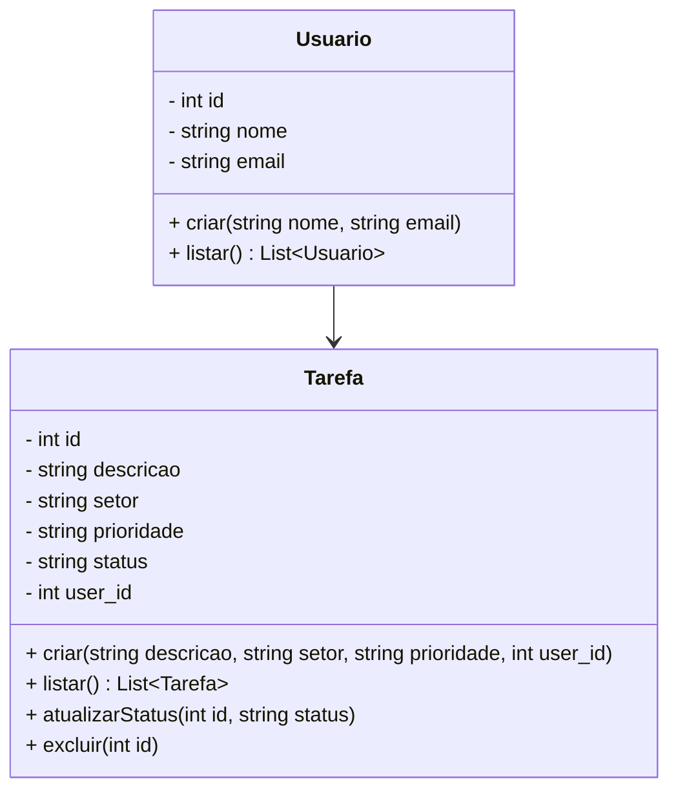
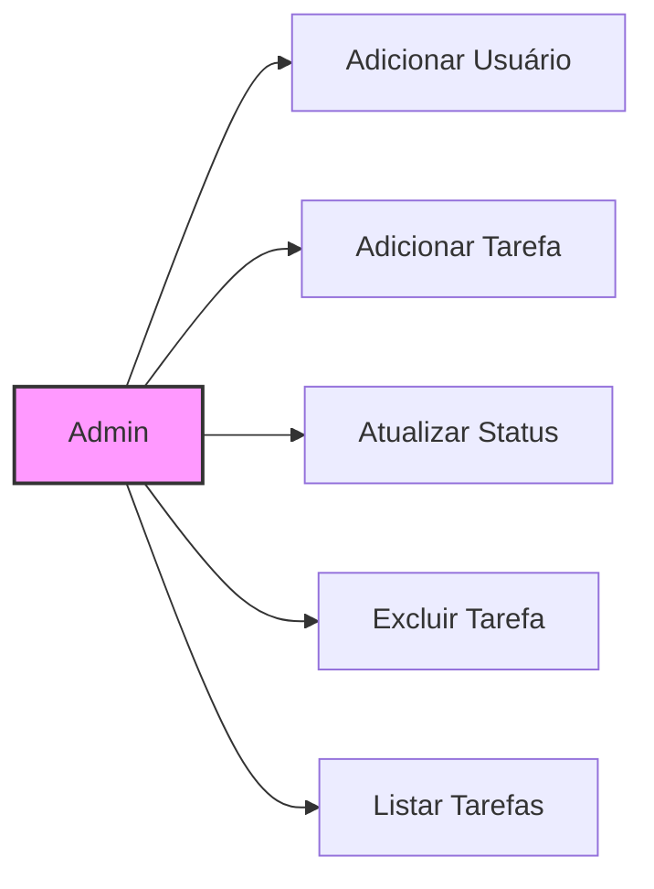

#Gerenciador de Tarefas
Esta é uma aplicação simples de gerenciamento de tarefas, desenvolvida em Node.js com Express e PostgreSQL. A aplicação segue a arquitetura MVC (Model-View-Controller) para organizar as responsabilidades.

#Estrutura da Aplicação
A aplicação está organizada nas seguintes camadas:

Model: Representa a lógica de dados e define as entidades (Usuário e Tarefa) no banco de dados.
View: Contém os arquivos HTML e CSS para a interface do usuário.
Controller: Interage com os modelos e manipula as requisições para retornar as respostas apropriadas.

#Diagrama de Classes
O diagrama de classes abaixo representa as principais classes da aplicação e suas relações.

#Explicação das Classes
Usuario:

Representa um usuário do sistema.
Métodos principais: criar para adicionar um usuário e listar para obter todos os usuários.
Tarefa:

Representa uma tarefa no sistema.
Métodos principais: criar para adicionar uma nova tarefa, listar para obter todas as tarefas, atualizarStatus para atualizar o status da tarefa, e excluir para remover uma tarefa.
Database:

Gerencia a conexão com o banco de dados PostgreSQL.
usuarioController:

Controlador que lida com as operações de usuário.
Métodos principais: listar para renderizar a lista de usuários e criar para adicionar um novo usuário via requisição HTTP.
tarefaController:

Controlador que lida com as operações de tarefas.
Métodos principais: listar para renderizar a lista de tarefas, criar para adicionar uma nova tarefa, atualizarStatus para atualizar o status de uma tarefa, e excluir para deletar uma tarefa.
Diagrama de Casos de Uso
O diagrama de casos de uso abaixo mostra as interações entre o administrador e as funcionalidades principais do sistema, que incluem gerenciamento de usuários e tarefas.

Explicação dos Casos de Uso
Adicionar Usuário: Permite que o administrador adicione um novo usuário ao sistema.

Adicionar Tarefa: Permite que o administrador adicione uma nova tarefa, associando-a a um usuário.

Atualizar Status: Permite que o administrador atualize o status de uma tarefa, alterando entre "A Fazer", "Fazendo" e "Pronto".

Excluir Tarefa: Permite que o administrador exclua uma tarefa do sistema.

Listar Tarefas: Exibe todas as tarefas organizadas em colunas com base no status (A Fazer, Fazendo, Pronto), possibilitando visualização rápida das tarefas.

Esses diagramas ajudam a visualizar e entender a organização e as interações na aplicação. O diagrama de classes fornece uma visão geral da estrutura de dados e dos métodos, enquanto o diagrama de casos de uso mostra as operações principais que o administrador pode realizar.